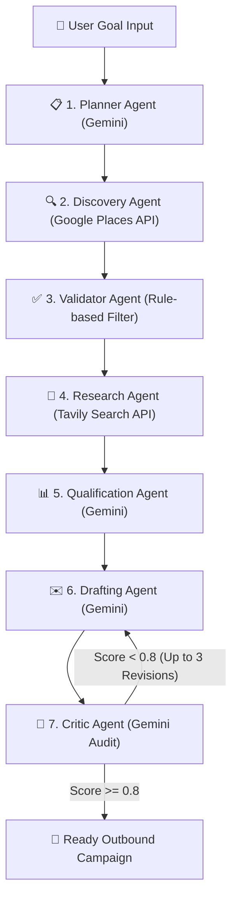

# 🚀 GrowthPilot — Autonomous Customer Acquisition Platform

GrowthPilot is an **AI-powered B2B outbound sales automation pipeline**, exposed as an **MCP (Model Context Protocol) server** coupled with a premium, real-time reactive web dashboard. 

By orchestrating multiple external APIs through a robust 7-stage self-correcting workflow, GrowthPilot transforms a simple goal like *"Find SaaS companies in Bangalore with 20-100 employees"* into qualified sales intelligence and personalized, audit-verified emails ready for outreach.

---

## 🔗 Live Production URLs

* **💻 Interactive Frontend (Vercel):** [https://ui-sigma-snowy.vercel.app](https://ui-sigma-snowy.vercel.app)
* **⚙️ Production MCP Backend (NitroStack Cloud):** [https://growthpilot-6a5af3-hyd-bros-amrita-university-amritapuri-campus.app.nitrocloud.ai](https://growthpilot-6a5af3-hyd-bros-amrita-university-amritapuri-campus.app.nitrocloud.ai)
* **🔌 Live SSE Handshake Endpoint:** `https://growthpilot-6a5af3-hyd-bros-amrita-university-amritapuri-campus.app.nitrocloud.ai/sse`

---

## ⚡ Quick Start for Judges (No Installation Required)

You do **not** need to install or run anything locally to test GrowthPilot:

1. Open the [Interactive Frontend URL](https://ui-sigma-snowy.vercel.app).
2. Enter a natural language goal in the input field, for example:
   > *"Find commercial printing businesses in Kerala interested in workflow automation"*
3. Click **Run Campaign**.
4. Watch the multi-agent pipeline execute in real time across all 7 stages on the live NitroStack Cloud container.
5. Once complete (~40 seconds), scroll down to see the leads. Click any card to expand the profile drawer to view the generated email copy and the quality audit score!

---

## 🧠 Why MCP? (The Composable Agent Difference)

Standard LLMs with "Deep Research" capabilities can browse the web and answer questions. GrowthPilot takes this further:
* **Task Accomplishment, Not Just Chat:** Instead of conversational answers, it outputs structured, actionable business deliverables (validated leads + ready-to-send copy).
* **Self-Correcting Pipeline:** A dedicated **Critic Agent** audits the output of the **Drafting Agent**, scoring it and automatically sending it back for revisions if it falls below our quality threshold.
* **Open Standard Composability:** Because it's an MCP server, any compatible AI client (Claude Desktop, Cursor, ChatGPT, custom CLI tools) can plug directly into the GrowthPilot server and gain these B2B prospecting tools instantly.

---

## 🏗️ Architecture



### The 7-Stage Pipeline
1. **Planner:** Parses user goals into structured campaign parameters (target industry, locations, filters).
2. **Discovery:** Queries Google Places live for matching businesses.
3. **Validator:** A zero-cost deterministic gate that filters out invalid industries, categories, or keywords.
4. **Research:** Crawls the web and scrapes online presence using Tavily.
5. **Qualification:** LLM-based scoring that assigns leads to High, Medium, or Borderline tiers based on fit.
6. **Draft:** Generates hyper-personalized cold outreach emails.
7. **Critic:** Audits emails for tone, placeholders, and length, revising automatically up to 3 times to hit a `0.8` quality score.

---

## 🛠️ MCP Primitives Implemented

GrowthPilot provides a complete set of Model Context Protocol features:
* **Tools:**
  * `gp_run_pipeline`: Orchestrates and runs the entire 7-stage campaign end-to-end.
* **Resources:**
  * `growthpilot://system/status`: Exposes real-time server health and active providers.
* **Prompts:**
  * `gp_campaign_brainstorm`: Assists users in brainstorming high-yield campaign goals based on their industry.

---

## 💻 Local Development Setup

The repository is structured as a monorepo containing:
* `/` (Root): The TypeScript + Node.js NitroStack MCP Server.
* `/ui`: The React + Vite + TypeScript Frontend dashboard.

### 1. Backend Setup
1. Clone the repository and install dependencies:
   ```bash
   npm install
   ```
2. Create a `.env` file in the root based on `.env.example`:
   ```env
   PORT=3000
   GEMINI_API_KEY=your_gemini_key
   TAVILY_API_KEY=your_tavily_key
   GOOGLE_MAPS_API_KEY=your_google_maps_key
   LIVE_MODE=true
   ```
3. Build and start the development server:
   ```bash
   npm run dev
   ```
4. (Optional) Run the test suite:
   ```bash
   npm run test
   ```

### 2. Frontend Setup
1. Navigate to the `/ui` directory and install dependencies:
   ```bash
   cd ui
   npm install
   ```
2. Start the Vite development server (configured to proxy `/sse` and `/mcp` to the backend on port 3000):
   ```bash
   npm run dev
   ```
3. Open `http://localhost:5173` in your browser.

---

## 🛡️ Security & Environment Credentials
* Credentials for all live APIs (Gemini, Google Maps, Tavily) are securely handled at the environment level inside the NitroStack Cloud container. No raw keys are exposed to the browser or checked into source control.
* Production builds compile cleanly with TypeScript ESM imports.
